# CI CD Project

## Task

1. Using Terraform, launch two instances: the target and the host, in each run its own script to install the necessary programs

2. After the push to github, the web hook that activates jenkins should work

3. Jenkins pulls the project from github using the jenkins pipeline

4. First, jenkins pipeline uses Docker to compile the image into Docker and push it to Docker Hub

5. Then, using Ansible, it connects to the target machine, pulls the image and runs it in a docker container.


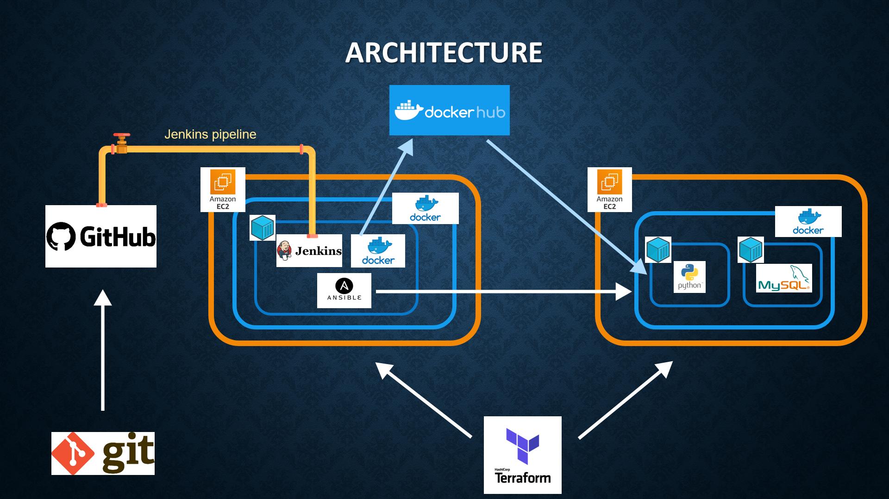

## Launching instances

In [terraform code](terraform/ubuntu_ec2_instances.tf) change access_key and secret_key to your keys

```
provider "aws" {
  region     = "us-east-1"
  access_key = "<Here was your access key>"
  secret_key = "<Here was your secret key>"
}
```

Then start the creating process

```
terraform init
terraform apply
```

## Host server configuration (with Jenkins)

First, add add permissions to docker socket (read and write for all)

```
sudo chmod a=rw /var/run/docker.sock
```

Next goto http://your-host-server-ip:8080/

For registration, you need to unlock Jenkins using the initial administrator password

```
sudo docker exec jenkins cat /var/jenkins_home/secrets/initialAdminPassword
```

Set english language as default (optional)

- Manage Jenkins >> Manage Plugins >> Available plugins

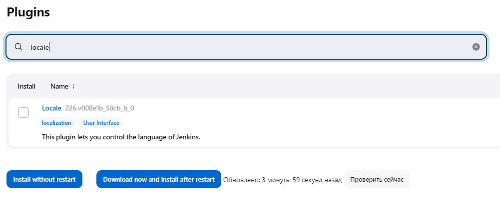

- Manage Jenkins >> Configure System

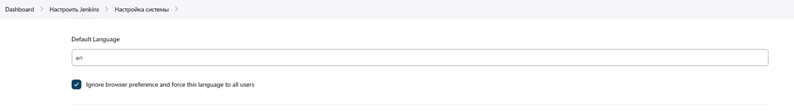

Install docker pipeline

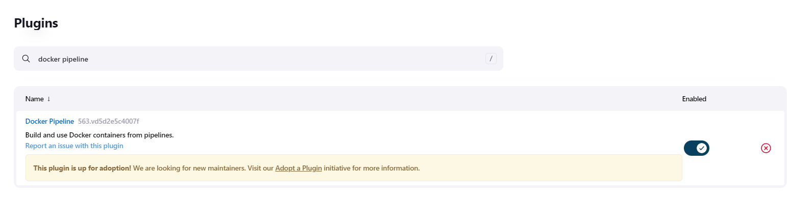

Install ansible plugin to jenkins

- Manage Jenkins >> Manage Plugins >> Available plugins

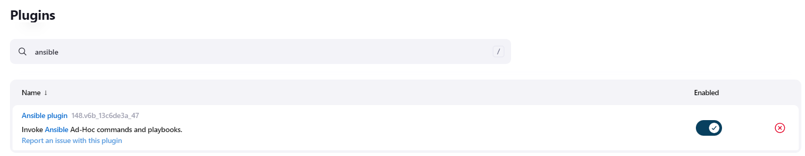

Need to download ansible to jenkins container

```
docker exec -it --user root jenkins bash

apt-get update

apt-get install -y ansible

Geographic area: 8

Time zone: 24
```

Create hosts file in ansible folder (need for connecting to machine where will target project)

```
cd /etc

mkdir ansible

cd ansible

nano hosts
```

- in 'hosts' file set ip of target server

```
[webserver]
34.231.253.38
```

Add credentials for ssh connection with machine

- Manage Jenkins >> Manage Credentials >> Available plugins

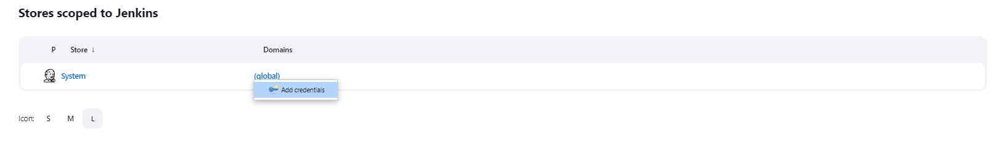

- create ssh credentials

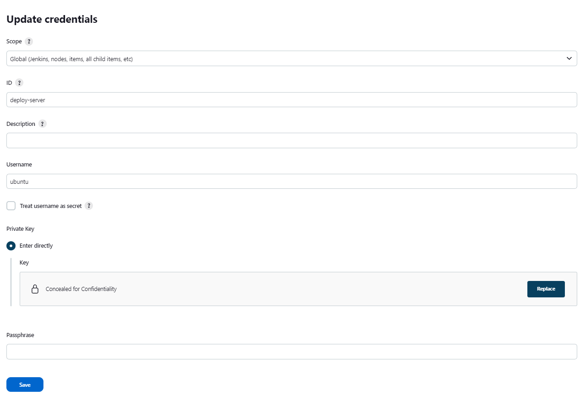

Add docker hub credentials

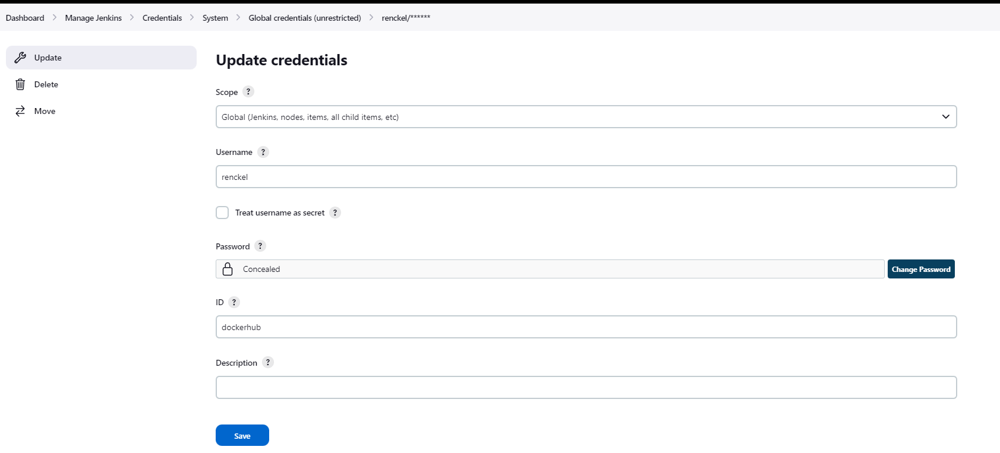

Add ansible tools for generate pipeline code

- Manage Jenkins >> Global Tool Configuration

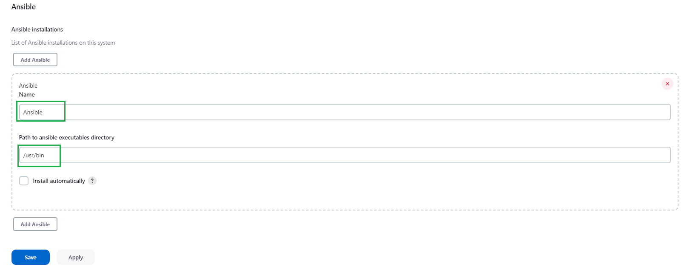

Add github webhook

- configure jenkins API Token

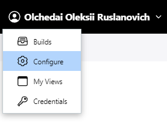

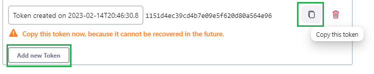

- add webhook in github

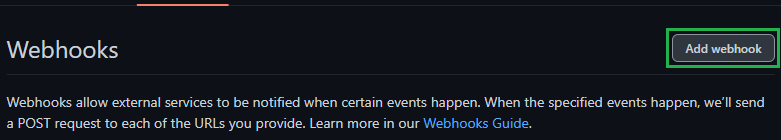

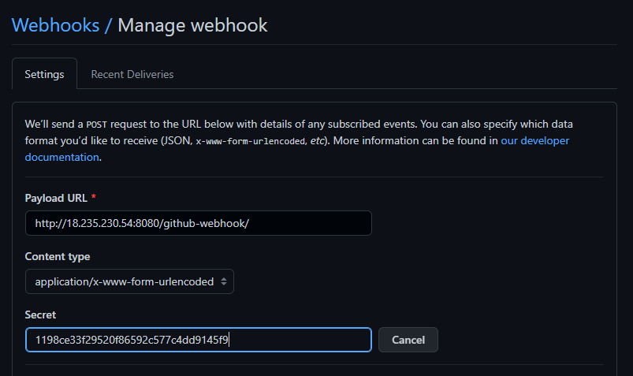

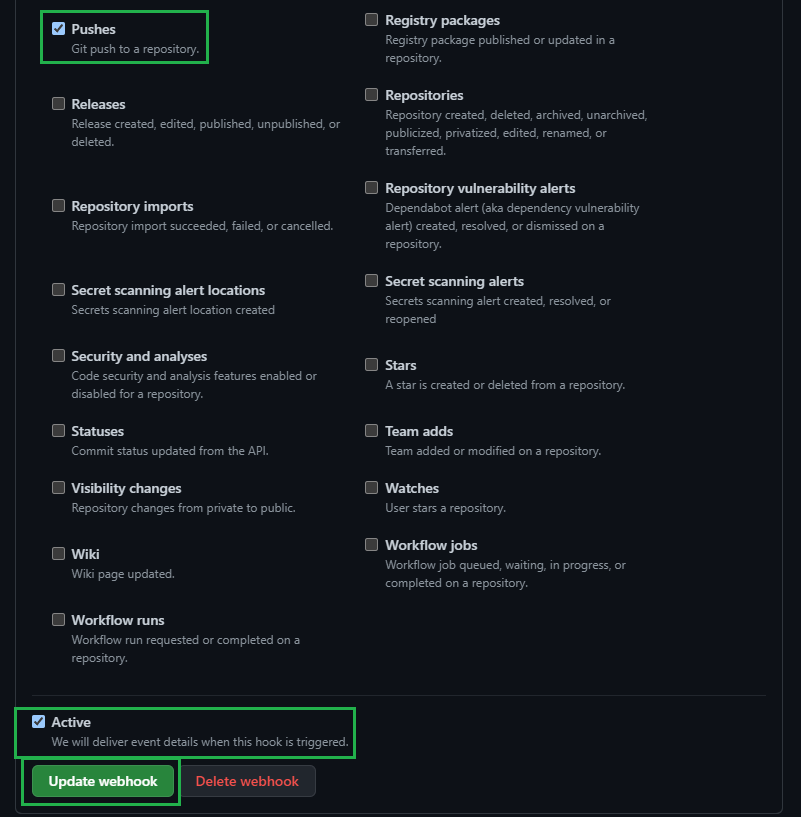

Add pipeline job with ansible

- create new job

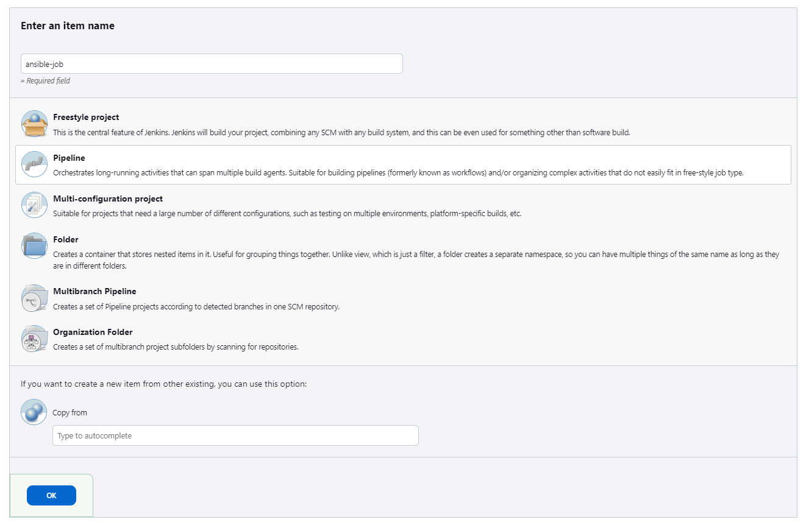

- add triggers

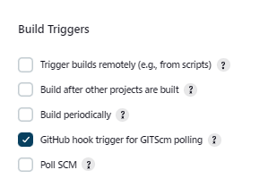

- pipeline code

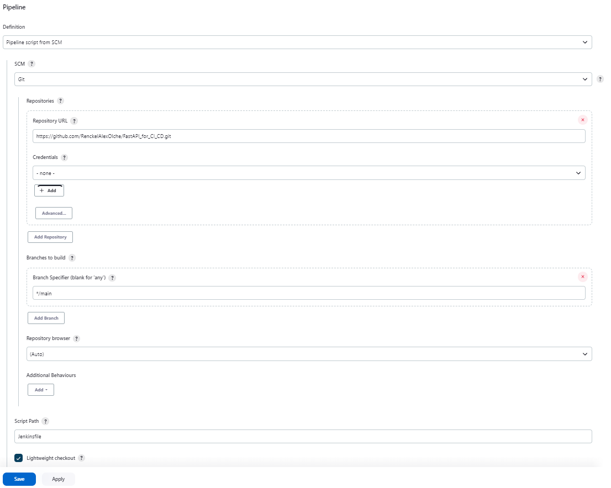

If job won't working, try execute this code in target machine

```
sudo docker exec mysql-server-container mysql -u root --password=31xLobOJO4fFUKE62oOFA8ev1jhFRq -e "create database devops_finaltask_db;"
```


