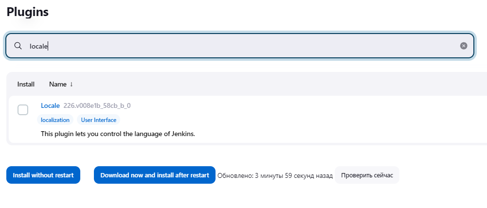

# how to achieve success

1. run jenkins container with docker inside

```
docker run -it --name jenkins -p 8080:8080 -p 50000:50000 -d -v jenkins_home:/var/jenkins_home -v /usr/bin/docker:/usr/bin/docker -v /var/run/docker.sock:/var/run/docker.sock mirekphd/jenkins-jdk17-on-ubuntu2204:latest
```

2. add permitions

```
sudo chmod a=rw /var/run/docker.sock
```

3. get jenkins password

```
docker exec <container-id> cat /var/jenkins_home/secrets/initialAdminPassword
```

4. set english language as default (optional)

- Manage Jenkins >> Manage Plugins >> Available plugins



- Manage Jenkins >> Configure System


5. next create project with Dockerfile and Jenkinsfile

- Dockerfile

```
FROM python:3.10

WORKDIR /code

COPY ./requirements.txt /code/requirements.txt

RUN pip install --no-cache-dir --upgrade -r /code/requirements.txt

COPY ./app /code/app

CMD ["uvicorn", "app.main:app", "--host", "0.0.0.0", "--port", "80"]
```

- Jenkinsfile

```
pipeline {
    agent any
    
    stages {
        stage('Build') {
            steps {
                sh 'docker build -t fastapi-app .'
            }
        }

    }
}
```

6. create pipeline job and setup it


7. after it run container with compiled project

```
docker run -p 80:80 fastapi-app
```


<!-- docker build -t fastapi-app . -->


