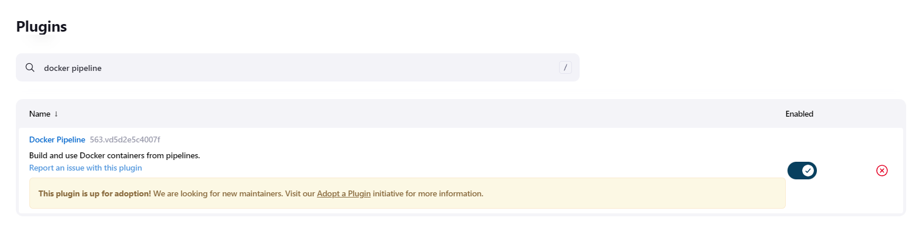
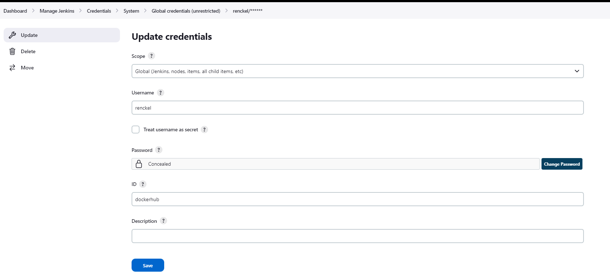

# how push to docker hub

1. install docker pipeline



2. change pipeline code

```
pipeline {
    agent any
       
    environment {
        DOCKERHUB=credentials('dockerhub')
    }

    stages {
        stage('Build image') {
            steps {
                sh 'docker build -t fastapi-app .'
            }
        }
        
        stage('Push image to docker hub') {
            steps {            
                sh 'docker tag fastapi-app:latest renckel/hello-fastapi:latest'
                sh 'echo $DOCKERHUB_PSW | docker login -u $DOCKERHUB_USR --password-stdin'
                
                sh 'docker push renckel/hello-fastapi:latest'
            }
        }
    }
}
```

3. add docker hub credentials



4. setup job


5. check your docker hub account

