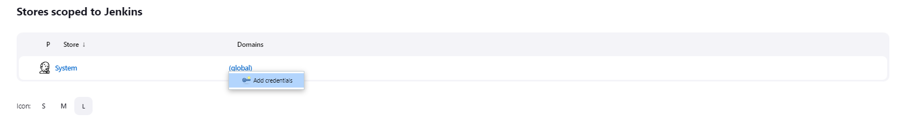
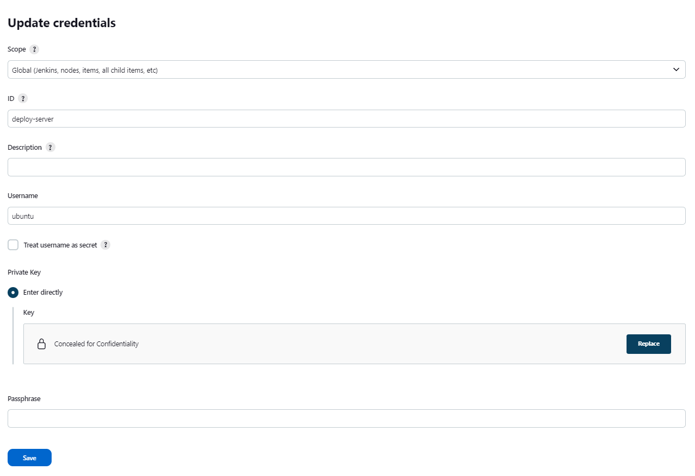
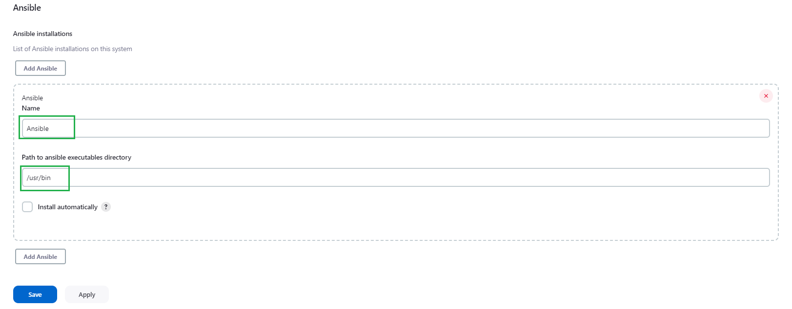

# how to pull docker image using ansible

1. need to download ansible to jenkins container

```
docker exec -it --user root jenkins bash

apt-get update

apt-get install -y ansible

Geographic area: 8

Time zone: 24
```

2. create hosts file in ansible folder (need for connecting to machine where will target project)

```
cd /etc

mkdir ansible

cd ansible

nano hosts
```

- in 'hosts' file set ip of target server

```
[webserver]
34.231.253.38
```

3. add yaml code to your project

- pullFastApi.yml file

```
---
- hosts: webserver
  become: true
  tasks:
    - name: install fastapi image
      shell: sudo docker pull renckel/hello-fastapi:latest

    - name: stop all containers
      shell: sudo docker stop $(sudo docker ps -q)

    - name: remove all containers
      shell: sudo docker rm $(sudo docker ps -a -q)

    - name: run fastapi container
      shell: sudo docker run --name target-project -p 80:80 -d renckel/hello-fastapi
```


4. install ansible plugin to jenkins

- Manage Jenkins >> Manage Plugins >> Available plugins


5. add credentials for ssh connection with machine

- Manage Jenkins >> Manage Credentials >> Available plugins



- create ssh credentials



6. add ansible tools for generate pipeline code

- Manage Jenkins >> Global Tool Configuration



7. add pipeline job with ansible

- create new job


- generate pipeline syntax


- after all copy this code


- edit code in your project with generated code

```
pipeline {
    agent any
       
    environment {
        DOCKERHUB=credentials('dockerhub')
    }

    stages {
        stage('Build image') {
            steps {
                sh 'docker build -t fastapi-app .'
            }
        }
        
        stage('Push image to docker hub') {
            steps {            
                sh 'docker tag fastapi-app:latest renckel/hello-fastapi:latest'
                sh 'echo $DOCKERHUB_PSW | docker login -u $DOCKERHUB_USR --password-stdin'
                
                sh 'docker push renckel/hello-fastapi:latest'
            }
        }
        
        stage('Ansible pull image') {
            steps {
                ansiblePlaybook credentialsId: 'deploy-server', disableHostKeyChecking: true, installation: 'Ansible', inventory: '/etc/ansible/hosts', playbook: 'pullFastApi.yml'
            }
        }
    }
}
```

- configure pipeline


8. run job


